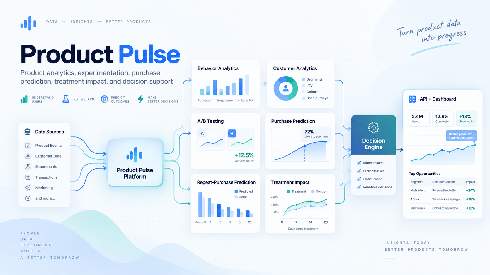

# ProductPulse

<p align="center">
  
</p>

**ProductPulse** is a production-oriented product analytics, experimentation, propensity, uplift, and decision-support platform built across four public datasets. It turns raw behavioral, transaction, and experiment data into reproducible analytical outputs, model results, API responses, and an interactive dashboard.

The datasets are intentionally treated as **independent product-data modules**. ProductPulse does not join unrelated users across datasets; instead, each dataset demonstrates a different analytical capability behind one common application layer.

## What ProductPulse does

| Capability | Dataset | Product question | Output |
|---|---|---|---|
| Behavioral analytics | Retailrocket | Where does the visitor journey lose users? | Funnel and engagement metrics |
| Customer analytics | Online Retail II | What drives customer and market performance? | Revenue, customer, and market summaries |
| A/B testing | Cookie Cats | Did moving the product gate improve retention? | Statistical tests and product decision |
| Purchase propensity | Retailrocket | Who is most likely to transact within 7 days? | Ranked transaction propensity |
| Repeat-purchase propensity | Online Retail II | Who is likely to purchase again within 60 days? | Repeat-purchase ranking |
| Treatment uplift | Criteo | Who is likely to convert because of treatment? | Individual uplift ranking |
| Decision layer | Multiple outputs | What action should a product team take? | Targeting and experiment policies |

## Architecture

```text
Public datasets
      │
      ▼
Cleaning + validation
      │
      ▼
Feature / experiment pipelines
      │
      ├──────────────┬────────────────┬────────────────┐
      ▼              ▼                ▼                ▼
Behavior        A/B testing      Propensity        Uplift
analytics                         models            models
      │              │                │                │
      └──────────────┴────────────────┴────────────────┘
                             │
                             ▼
                    Canonical results/
                             │
                             ▼
                         FastAPI
                             │
                             ▼
                    Next.js + Recharts
                             │
                             ▼
                    Product decisions
```

The canonical `results/<dataset>/` folders provide a stable boundary between analytical pipelines and the API. Notebook-specific outputs can change without forcing the dashboard to know which notebook created a file.

## Key results

### Cookie Cats — randomized experiment

| Metric | Gate 30 | Gate 40 | Gate 40 − Gate 30 | p-value | Decision |
|---|---:|---:|---:|---:|---|
| Day-1 retention | 44.82% | 44.23% | -0.59 pp | 0.0755 | No clear winner |
| Day-7 retention | 19.02% | 18.20% | -0.82 pp | 0.0016 | Keep `gate_30` |

<p align="center">
  
</p>

The day-7 difference is statistically significant in this experiment, while the day-1 difference does not meet the same evidence threshold.

### Retailrocket — 7-day transaction propensity

The selected model is **HistGradientBoosting**, chosen using validation PR-AUC under a highly imbalanced purchase target.

| Metric | Validation | Test |
|---|---:|---:|
| ROC-AUC | 0.8595 | 0.8622 |
| PR-AUC | 0.0646 | **0.1406** |
| F1 | 0.1699 | **0.2418** |
| Lift @ top 1% | 40.00× | **47.10×** |
| Lift @ top 5% | 12.19× | **12.90×** |
| Lift @ top 10% | 6.71× | **7.17×** |

<p align="center">
  
</p>

At the top 1% targeting depth, the selected model captures roughly 47% of observed future purchasers and achieves about **47.1× lift** relative to the population purchase rate.

### Retailrocket — behavioral analytics

| Metric | Result |
|---|---:|
| Events | 2,755,641 |
| Unique visitors | 1,407,580 |
| Unique items | 235,061 |
| Transaction events | 22,457 |
| Viewer → cart | 2.686% |
| Viewer → transaction | 0.835% |
| Cart → transaction | 31.067% |

### Criteo — causal uplift targeting

The canonical CLI verification run below used **40,000 rows**: 20,000 treated and 20,000 control observations, with 30,000 rows used for training and 10,000 for test evaluation.

| Targeted population | Observed uplift |
|---:|---:|
| Top 1% | -4.295 pp |
| Top 5% | +0.998 pp |
| Top 10% | **+1.072 pp** |
| Top 20% | +0.409 pp |
| Full test population | +0.160 pp |

<p align="center">
  
</p>

The top-1% estimate is based on only 100 test observations and is correspondingly noisy. The broader targeting depths are more stable for interpretation.

Current canonical run summary:

| Metric | Result |
|---|---:|
| Rows | 40,000 |
| Training rows | 30,000 |
| Test rows | 10,000 |
| Mean predicted uplift | 0.002273 |
| Qini coefficient | 1.0990 |

### Online Retail II — customer and revenue analytics

| Metric | Result |
|---|---:|
| Clean rows | 1,007,913 |
| Identified customers | 5,878 |
| Canonical total revenue | $20.48M |
| Date range | Dec 2009 – Dec 2011 |
| Repeat buyers | 4,255 |
| Repeat-buyer rate | 72.39% |
| Median orders per customer | 3 |
| Median customer revenue | $887.39 |

The richer sales-filtered customer/product analytics layer also tracks orders, products, countries, customer value, and market revenue concentration.

## Model and experiment design

### Retailrocket

- 21-day behavioral lookback
- 7-day recent-activity features
- 7-day future-transaction target
- chronological 60/20/20 temporal split
- Logistic Regression and HistGradientBoosting
- balanced training weights for the rare-event target
- model selection by validation PR-AUC
- ranking evaluation at 1%, 5%, and 10% targeting depth

### Online Retail II

- 180-day purchase history
- 30-day recent window
- 60-day repeat-purchase target
- chronological train/validation/test evaluation
- Logistic Regression and HistGradientBoosting
- customer-level behavioral and revenue features

### Criteo uplift

- pre-treatment features `f0`–`f11`
- treatment/control T-learners
- Logistic Regression and HistGradientBoosting
- stratification by treatment × conversion
- validation-based model selection using Qini
- targeting evaluation at 1%, 5%, 10%, 20%, and 100%

### Cookie Cats

- randomized `gate_30` vs `gate_40` experiment
- day-1 and day-7 retention
- chi-square testing for retention
- Welch and Mann–Whitney tests for game-round behavior
- explicit decision policy rather than relying only on a p-value

## Project structure

```text
ProductPulse/
├── api/                       # FastAPI application and routes
├── dashboard/                 # Next.js + Recharts dashboard
├── src/productpulse/
│   ├── data/                  # cleaning, loading, validation
│   ├── features/              # temporal feature construction
│   ├── models/                # propensity and uplift models
│   ├── evaluation/            # classification and uplift metrics
│   ├── experimentation/       # A/B testing
│   ├── decisions/             # targeting / decision policies
│   ├── services/              # result persistence
│   └── orchestration.py       # pipeline orchestration
├── results/
│   ├── cookie_cats/
│   ├── criteo/
│   ├── online_retail/
│   └── retailrocket/
├── tests/
├── configs/
├── notebooks/                 # research and analysis traceability
├── artifacts/                 # serialized model artifacts
├── Dockerfile
├── docker-compose.yml
└── pyproject.toml
```

## Canonical pipeline commands

```bash
# Cookie Cats experiment
PYTHONPATH=src python -m productpulse run cookie-cats

# Criteo uplift
PYTHONPATH=src python -m productpulse run criteo --criteo-per-arm 20000

# Online Retail II
PYTHONPATH=src python -m productpulse run online-retail

# Retailrocket
PYTHONPATH=src python -m productpulse run retailrocket
```

The CLI writes application-facing outputs to:

```text
results/cookie_cats/
results/criteo/
results/online_retail/
results/retailrocket/
```

## API

Run locally:

```bash
PYTHONPATH=src uvicorn api.main:app --reload --port 8000
```

Main endpoints:

```text
GET /health
GET /api/overview
GET /api/analytics/retailrocket
GET /api/analytics/online-retail
GET /api/analytics/experiment
GET /api/propensity/retailrocket
GET /api/propensity/online-retail
GET /api/uplift/criteo
GET /api/decisions
```

FastAPI interactive documentation is available at `http://localhost:8000/docs`.

## Dashboard

For local development:

```bash
cd dashboard
npm install
npm run dev
```

Open `http://localhost:3000`.

The dashboard surfaces:

- experiment decisions and retention comparisons
- Retailrocket conversion and engagement metrics
- purchase-propensity lift by targeting depth
- Criteo causal-uplift targeting curves
- Online Retail customer and revenue analytics
- consolidated decision cards

## Docker

Build and run the API and dashboard together:

```bash
docker compose build
docker compose up -d
```

Then open:

```text
Dashboard: http://localhost:3000
API:       http://localhost:8000
API docs:  http://localhost:8000/docs
```

The API container can mount `results/` and `artifacts/` so newly generated outputs can be served without rebuilding the image.

## Tests

Run the full Python test suite:

```bash
PYTHONPATH=src python -m pytest -v
```

Run the dashboard-facing API contract tests:

```bash
PYTHONPATH=src python -m pytest tests/test_api_contracts.py -v
```

The API contract suite verifies the JSON fields consumed by the dashboard for:

- health
- Cookie Cats experimentation
- Online Retail analytics
- Retailrocket behavioral analytics
- Retailrocket propensity
- Criteo uplift

This allows model metrics to change after retraining while keeping the backend → frontend interface stable.

## Technology stack

| Layer | Technology |
|---|---|
| Analytics / ML | Python, pandas, NumPy, scikit-learn, SciPy |
| Data storage | CSV, Parquet, JSON |
| API | FastAPI |
| Dashboard | Next.js, React, TypeScript, Recharts |
| Model persistence | joblib |
| Testing | pytest, FastAPI TestClient |
| Packaging | `pyproject.toml` / setuptools |
| Runtime | Docker, Docker Compose |

## Reproducibility notes

- Temporal features are constructed without using future observations.
- Model selection is performed on validation data rather than test performance.
- Purchase-propensity evaluation emphasizes PR-AUC, recall, precision, and lift because the target is highly imbalanced.
- A/B testing is kept separate from observational prediction.
- Uplift scores are interpreted as treatment-effect ranking rather than ordinary conversion propensity.
- The four public datasets represent independent analytical modules and are not row-level joined.

## Next enhancements

- persistent run history and model/version metadata
- drift and data-quality monitoring
- automated scheduled pipeline execution
- authentication and role-based dashboard access
- cloud deployment
